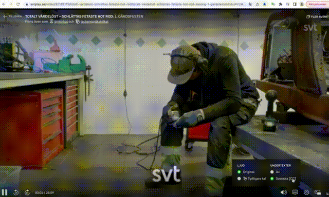

# svtplay.se Subtitle Translations

This Google Chrome extension provides automatic translations for video streams by Swedish broadcasting service SVT. 

## Disclaimer

This extension is not associated with Sveriges Television. Enabling Chrome's developer mode can be dangerous. 
The code was hacked together, quick 'n'dirty. Use this extension at your own risk.

## Initial Setup

1. Clone the repository, or download ZIP-file and unpack
2. In Chrome open `chrome://extensions/`
3. Turn on developer mode (top-right corner)
4. Hit *Load unpacked*-button and select the directory

The extension should be available now with 

## How to use

1. Start streaming the desired video on svtplay.se
2. Enable Swedish subtitles *Svenska [CC]*
3. Wait for the first subtitle to appear and pause
4. Open the extension's menu and select *Prepare subtitles*
5. When the full subtitles are displayed, use Chrome's built-in translation feature
6. Select *Apply subtitles* from the extension's menu

## Attributions

* Shown in screencast: [Totalt värdelöst – Schlättas fetaste hot rod](https://www.svtplay.se/video/32189115/totalt-vardelost-schlattas-fetaste-hot-rod/totalt-vardelost-schlattas-fetaste-hot-rod-sasong-1-gardsfesten)
* [Translate icons created by photo3idea_studio - Flaticon](https://www.flaticon.com/free-icons/translate)
